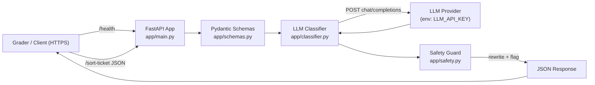
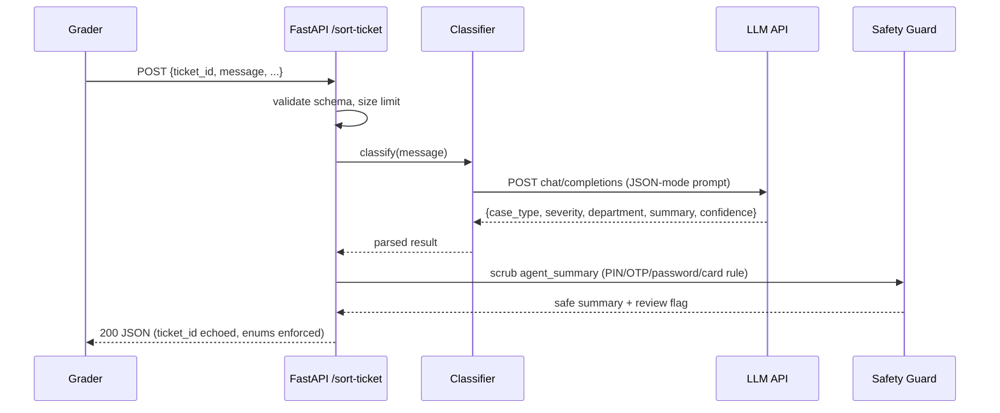

## Plan: QueueStorm Sort-Ticket Service

Build a FastAPI service for the **QueueStorm Warmup** mock hackathon. It exposes `GET /health` and `POST /sort-ticket`, classifies each support message via an LLM, enforces the **safety rule** (never request PIN/OTP/password/card number), and ships with a public GitHub repo + HTTPS deployment + runbook.

**Steps**

1. **Scaffold repo** — create `app/`, `tests/`, `README.md`, `runbook.md`, `.env.example`, `.gitignore`, `requirements.txt`. (parallel with 2)
2. **Define schemas** — Pydantic models in `app/schemas.py` matching the problem's Request/Response: `ticket_id`, `channel` (enum), `locale` (enum), `message`; response with `case_type` (enum), `severity` (enum), `department` (enum), `agent_summary`, `human_review_required` (bool), `confidence` (float 0–1).
3. **Implement rules + LLM classifier** — `app/classifier.py`: build a JSON-only prompt (system + few-shot using the 5 public sample cases) that returns `{case_type, severity, department, agent_summary, confidence}`. Call LLM via HTTP using `httpx` with `LLM_API_KEY`, `LLM_BASE_URL`, `LLM_MODEL` from env. Set `human_review_required = true` when severity == "critical" OR case_type == "phishing_or_social_engineering".
4. **Safety guard** — `app/safety.py`: post-process `agent_summary`; if it contains any of `pin, otp, password, cvv, card number` (case-insensitive) in a requesting context (regex like "share your ...", "send your ..."), **replace** with a safe rewrite and force `human_review_required = true`. Log a warning. (depends on 3)
5. **Department override** — if `case_type == "phishing_or_social_engineering"`, force `department = "fraud_risk"` even if LLM says otherwise (defensive consistency with enum table).
6. **FastAPI app** — `app/main.py`: `GET /health` returns `{"status":"ok"}`; `POST /sort-ticket` validates input, calls classifier + safety guard, echoes `ticket_id`, returns the schema. Add request size limit (e.g. 4KB) and a 25s timeout on the LLM call.
7. **Security hardening** — env-only secrets (`.env` gitignored, `.env.example` checked in), no secrets in logs, CORS locked to `*` is fine for the grader but no auth leaks, dependency pin in `requirements.txt`, input length cap, structured error responses that never echo the raw message back on errors. Add a `SECURITY.md` note in README. (parallel with 3–6)
8. **Tests** — `tests/test_api.py`: `/health` returns 200 in <10s; `/sort-ticket` matches expected `case_type` + `severity` for all 5 public sample cases; safety guard rejects summaries asking for OTP/PIN/password/card; `human_review_required` true for phishing + critical; confidence ∈ [0,1]; `ticket_id` echoed. Use `pytest` + `fastapi.testclient`.
9. **Deployment runbook** — `runbook.md` with: env vars, install (`pip install -r requirements.txt`), run (`uvicorn app.main:app --host 0.0.0.0 --port 8000`), how to deploy to Render/Railway/Fly (pick one), how to set `LLM_API_KEY`, how to verify `curl https://<url>/health` and a sample `curl -X POST /sort-ticket`. (depends on 8)
10. **README** — short problem summary, endpoints, sample request/response, how to run locally, deployment link, security notes, known issues placeholder.
11. **Final verification** — run `pytest`, hit live `/health`, hit live `/sort-ticket` with all 5 sample cases, confirm safety rule on a phishing message asking for OTP. Fill the Google Form fields (team name, repo URL, live URL, platform, LLM used, known issues).

**Relevant files**
- `app/main.py` — FastAPI app, routes, timeout, error handling
- `app/schemas.py` — Pydantic Request/Response models mirroring problem schema
- `app/classifier.py` — LLM call + prompt + few-shot examples + JSON parsing
- `app/safety.py` — post-process `agent_summary` against PIN/OTP/password/card rule
- `app/config.py` — env loading (`LLM_API_KEY`, `LLM_BASE_URL`, `LLM_MODEL`)
- `tests/test_api.py` — covers the 5 public samples + safety + health
- `requirements.txt` — `fastapi`, `uvicorn`, `httpx`, `pydantic`, `pytest`
- `.env.example` — documents required env vars, no values
- `.gitignore` — `.env`, `__pycache__`, `.venv`
- `README.md` — problem, endpoints, samples, run, deploy link, security
- `runbook.md` — replicate-the-deployment steps for the grader

**Diagrams**

**Verification**
1. `pytest -q` — all 5 public samples return the expected `case_type` + `severity`; safety test confirms phishing summary never asks for OTP/PIN/password/card.
2. `curl https://<live>/health` returns `{"status":"ok"}` in under 10s.
3. `curl -X POST https://<live>/sort-ticket -d '{"ticket_id":"T-1","message":"Someone called asking my OTP, is that bKash?"}'` returns `case_type=phishing_or_social_engineering`, `severity=critical`, `department=fraud_risk`, `human_review_required=true`, and a summary that does **not** request OTP/PIN/password/card number.
4. `grep -R "LLM_API_KEY\|sk-\|password\s*=" .` returns nothing committed (secrets only in env).
5. Google Form fields filled: team name, public GitHub URL, live HTTPS URL, deployment platform, LLM yes/no + model, known issues.
